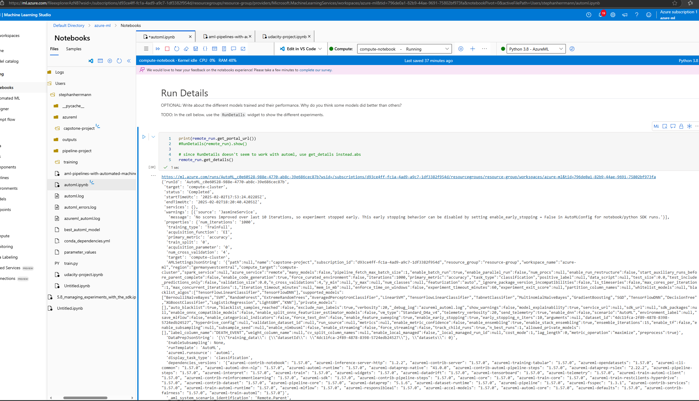
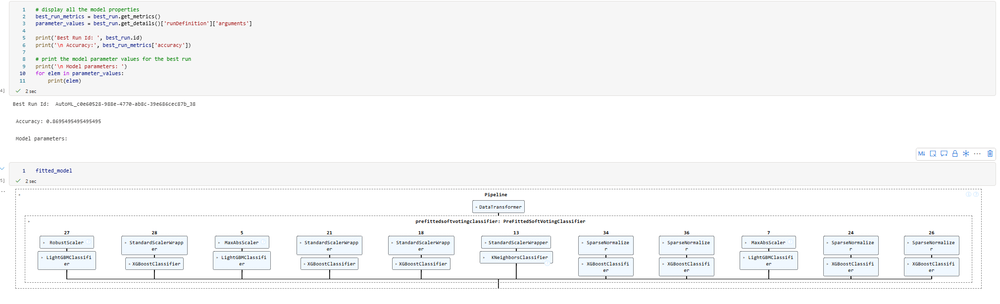
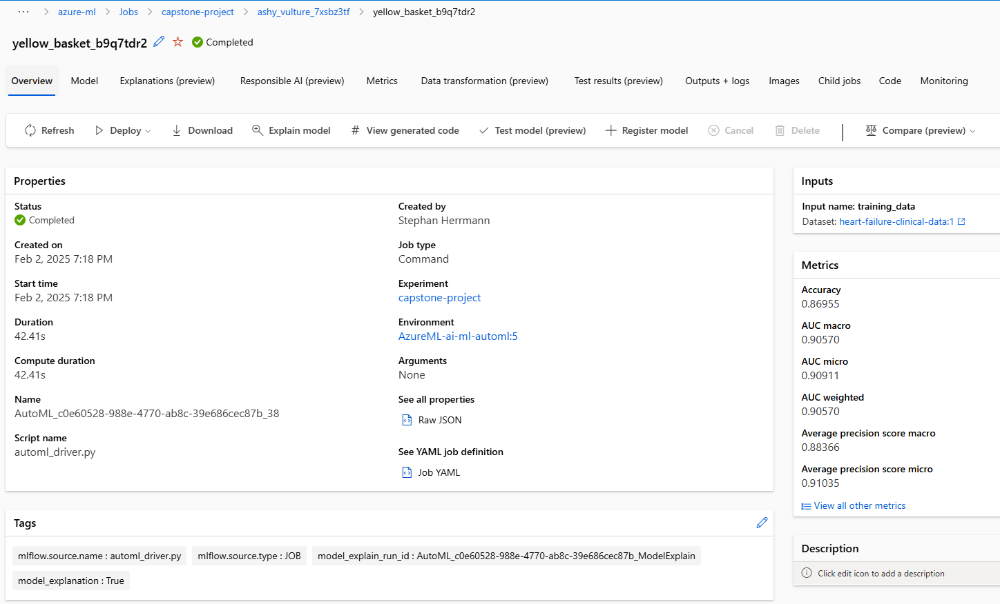
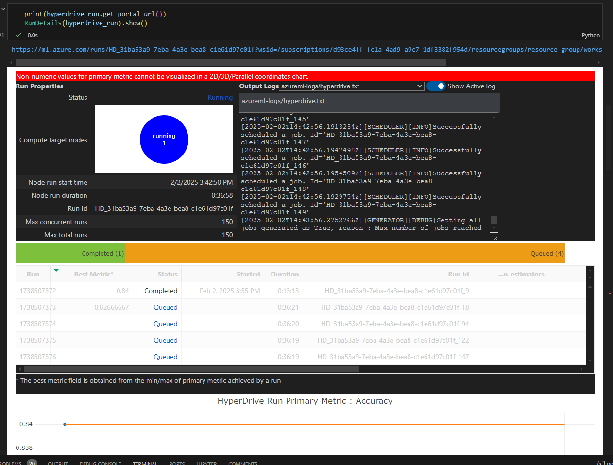
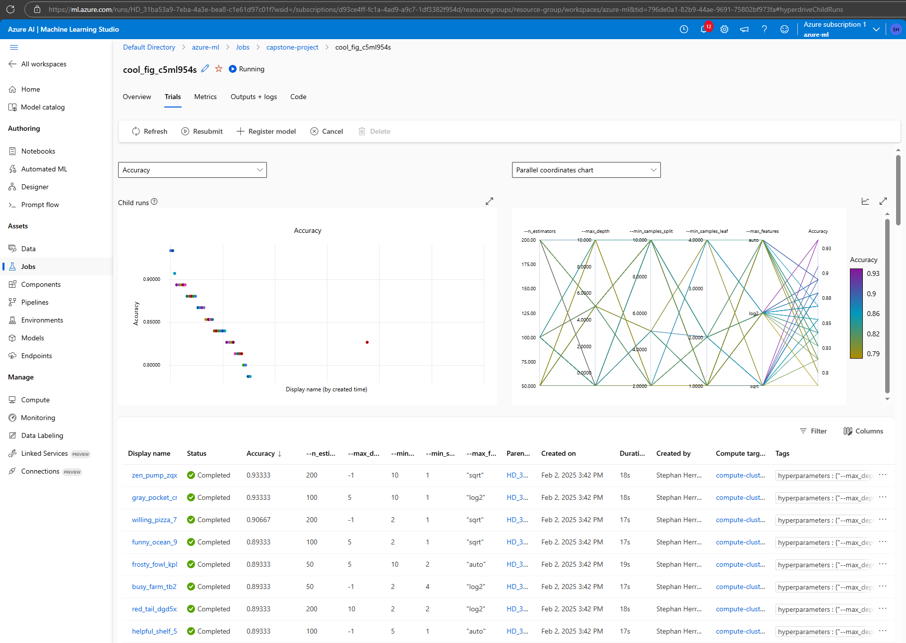
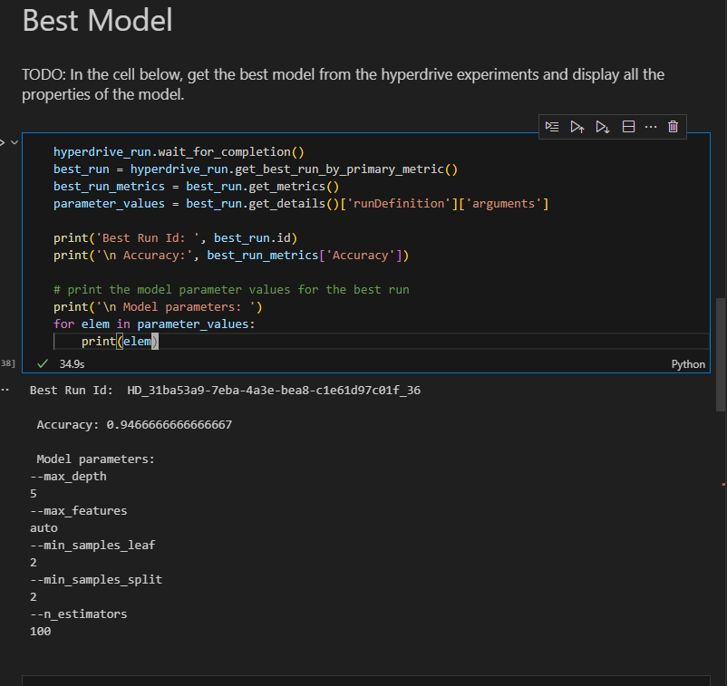
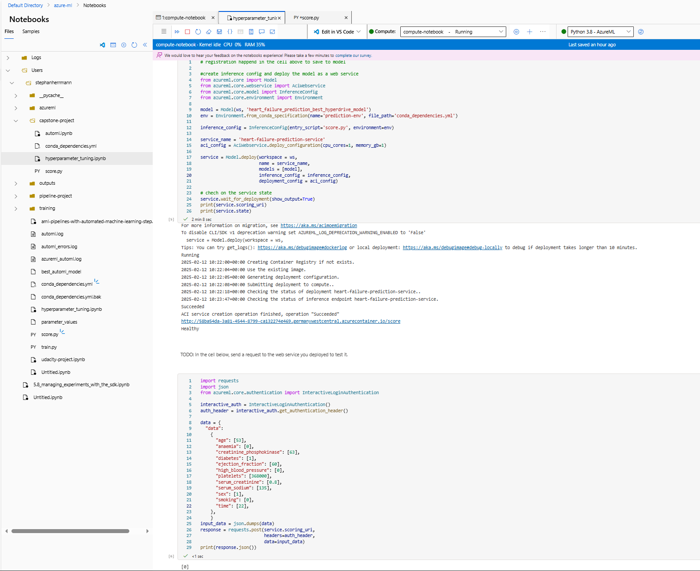
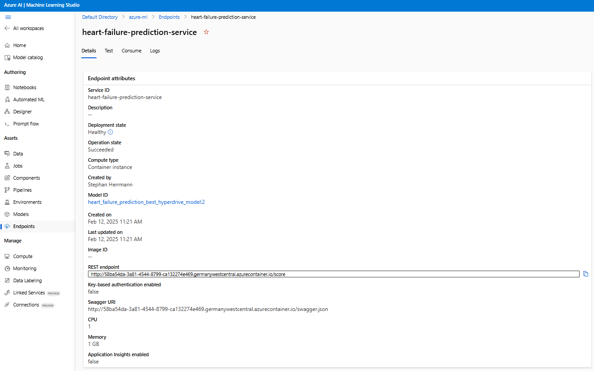

# Predicting Survival of Patients with Heart Failure

This project trains and deploys a machine learning model that predicts heart failures based on patient data like age, diabetes status, serum sodium level, and other biomarkers.
A potential use case (after validation and certification): a physician or other medical professional could use the model to predict whether a patient is at risk of a heart failure.

## Project Set Up and Installation

To use the project, copy the project files into the files section of the Azure ML Notebooks area.
In particular, the relevant files are the `.ipynb` notebooks, the conda_dependencies.yml and the `.py` scripts all located in the starter_file folder.

Open one of the `.ipynb` files in AzureML notebooks.
Crucially, since the code uses AzureML SDK 1, you have to pick the "Python 3.8 - AzureML" kernel which takes care of further dependencies to run the project.

Another option to use the project is to run the notebooks locally.
To enable this, download the config.json of your Azure subscription into the starter_file folder before running the scripts.
Additionally, you need to install the Python dependencies (preferably into a virtual environment) which are listed at the top of the notebooks and Python files using e.g. ```pip install```.

## Dataset
### Overview

The dataset contains data about the survival of patients with heart failure and some of their personal data like age and biomedical markers like serum creatinine.

Full details about the dataset origin:
Davide Chicco, Giuseppe Jurman: Machine learning can predict survival of patients with heart failure from serum creatinine and ejection fraction alone. BMC Medical Informatics and Decision Making 20, 16 (2020)

Link to paper: https://doi.org/10.1186/s12911-020-1023-5

Dataset obtained via Kaggle (https://www.kaggle.com/datasets/andrewmvd/heart-failure-clinical-data) under the CC BY 4.0 License (https://creativecommons.org/licenses/by/4.0/).

### Task

The task is to predict the survival of patients with heart failure to aid medical practitioners in patient care.

The features are the following:  
- age
- anaemia (yes/no)
- creatinine phosphokinase
- diabetes (yes/no)
- ejection fraction
- high blood pressure (yes/no)
- platelets number
- serum creatinine
- serum sodium
- sex
- smoking (yes/no)
- follow-up time

### Access

To access the data in the workspace, I first uploaded the csv data to my workspace to create dataset.
In the code, I can work with the dataset using
```python
dataset_name = "heart-failure-clinical-data"
dataset = Dataset.get_by_name(ws, name=dataset_name)
```

## Automated ML

The AutoML run used the following settings.

Experiment Timeout: The experiment was set to run for a maximum of 1 hour. This  helps limit compute resources and thus cost.

Max Concurrent Iterations: The maximum number of iterations that can run concurrently was set to 1, limited due to quota restrictions of my Azure subscription.

Task Type: The task type was set to classification, as the goal was to predict a categorical outcome (survival of patients with heart failure).

Primary Metric: The primary metric used to evaluate the models was accuracy. This metric measures the proportion of correctly predicted instances out of the total instances and is suitable for classification tasks.

Training Data: this is the dataset described in the previous section.

Label Column Name: The column containing the target variable is named DEATH_EVENT.

Cross-Validation: The experiment used 4-fold cross-validation to evaluate the performance of the models. Cross-validation helps in assessing the model's ability to generalize to unseen data by splitting the data into training and validation sets multiple times.

Early Stopping: Early stopping was enabled to stop the training process if the model's performance does not keep improving with more iterations.

Compute Target: The models were trained on a compute cluster with a single node of a `Standard_D4a_v4` VM.

### Results

The screenshot below shows the details of the AutoML run. Its using the ```get_details()``` method instead of the RunDetails widget since the RunDetails widget doesn't seem to work with AutoML or AzureML SDK 1 anymore, resulting in error messages.


The best model found by AutoML achieves an accuracy of 0.87.
It is a so called VotingEnsemble where several models are trained and their predictions combined to achieve a higher performance.
Due to the number of parameters within this VotingEnsemble, listing and explaining every chosen parameter is excessive.
We can, however have a look at the architecture of the VotingEnsemble to get an overview.
The architecture is illustrated in the screenshot below.
For each sub-model, we can see a weight, a feature preprocessing step (e.g., MaxAbsScaler), and the sub-models themselves.
The majority of the sub-models are variants of tree ensembles, with the KNearestNeighborClassifier as the only exception.


We can further inspect the model in AzureML Studio by going to the run details


To improve the model, we could spend more time for hyper parameter tuning since there are so many hyper parameters available that it is likely that we have not found an optimal parameterization.
One way to achieve this is to use more compute during the AutoML run.
A perhaps more efficient way without more compute is to use the allowed_models argument to AutoMLConfig.
We can list the models that were chosen previously as the allowed models to specialize the search to them for a more efficient use of compute resources. 

## Hyperparameter Tuning

I chose the RandomForestClassifier because I have worked with it in the past and because it offers a good tradeoff between the number of hyper parameters that you have to tune and its high performance ceiling.
Models like XGBoost seem to perform better but to me they seem to also be more complex to understand.

The Random Forest Classifier works by constructing multiple decision trees during training and combining their outputs to improve accuracy and control overfitting. Each tree is trained on a random subset of the data. To construct a decision tree, the data is partitioned into smaller subsets and at each split in the tree, a random subset of features is considered. The data that belongs at a leave of a trained decision tree has the same predicted class.

The parameters used for hyperparameter tuning have the following meaning.

n_estimators: This parameter specifies the number of decision trees in the forest. More trees generally improve the model's performance and stability but also increase computational cost.

max_depth: This parameter sets the maximum depth of each tree. Limiting the depth of the trees helps prevent overfitting by restricting the model's complexity.

min_samples_split: This parameter defines the minimum number of samples required to split an internal node. Splitting an internal node refers to the process of dividing the data at that node into two or more subsets based on a specific condition or feature value.

min_samples_leaf: This parameter sets the minimum number of samples required to be at a leaf node. It helps ensure that leaf nodes have enough samples to make reliable predictions, reducing the risk of overfitting.

max_features: This parameter determines the number of features to consider when looking for the best split. 

### Results

After starting the hyperdrive run, we can inspect its status using the `RunDetails` widget as shown in this screenshot.


We can follow the progress of the runs in more details in the AzureML studio using the Trials tab of the run:


The best model found by hyperparameter tuning achieved an accuracy of 0.947. The parameters for the RandomForestClassifier are:

- `max_depth`: 5
- `max_features`: "auto"
- `min_samples_leaf`: 2
- `min_samples_split`: 2
- `n_estimators`: 100



To improve the model further, we could experiment with different ranges for these parameters or try other classifiers like XGBoost, which might offer better performance at the cost of increased complexity.

## Model Deployment
The following code is deploying the model as an Azure Container Instance endpoint:

```python
model = Model(ws, 'heart_failure_prediction_best_hyperdrive_model')
env = Environment.from_conda_specification(name='prediction-env', file_path='conda_dependencies.yml')

inference_config = InferenceConfig(entry_script='score.py', environment=env)

service_name = 'heart-failure-prediction-service'
aci_config = AciWebservice.deploy_configuration(cpu_cores=1, memory_gb=1)

service = Model.deploy(workspace = ws,
                       name = service_name,
                       models = [model],
                       inference_config = inference_config,
                       deployment_config = aci_config)
```

The last line deploys the model to an Azure Container Instance (ACI). The `Model.deploy` method takes several parameters:

- workspace: The Azure Machine Learning workspace where the model is registered.
- name: The name of the deployed service.
- models: A list of models to be deployed (in this case, just our RandomForest model).
- inference_config: Configuration for how the model should be run (e.g., the scoring script and environment).
- deployment_config: Configuration for the deployment itself (e.g., resource allocation)

The inference config specifies the environment, i.e. the required conda dependencies given in a yaml file, as well as the so called scoring script, which is also part of this project and repository.

The scoring script `score.py` defines how the model is loaded by the deployment and how it handles incoming prediction requests.

The init function is called once when the web service is started.
It loads the trained model from the registered model in the Azure Machine Learning workspace.

The run function is called for each prediction request.
It receives the input data in JSON format, parses it, and converts it into a format suitable for the model, in this case, a Pandas dataframe.
The function then uses the loaded model to make predictions based on the input data.
The predictions are returned in JSON format as the response to the request.

After deploying the model, we can check its status directly in the notebook and also in AzureML Studio, as shown in the two screenshots below.





To query the deployed model with a sample input, we use the Python requests library to send an HTTP POST request to the model's endpoint.
We first get an authentication header for the request using
```python
interactive_auth = InteractiveLoginAuthentication()
auth_header = interactive_auth.get_authentication_header()
```
Then, we prepare the input data in JSON format using the features required by the model:
```python
data = {
  "data":
    {
      "age": [53],
      "anaemia": [0],
      "creatinine_phosphokinase": [63],
      "diabetes": [1],
      "ejection_fraction": [60],
      "high_blood_pressure": [0],
      "platelets": [368000],
      "serum_creatinine": [0.8],
      "serum_sodium": [135],
      "sex": [1],
      "smoking": [0],
      "time": [22],
    },
    }
input_data = json.dumps(data)
```

Now we can actually send the request and print the response.
```python
response = requests.post(service.scoring_uri,
                         headers=auth_header,
                         data=input_data)
print(response.json())
```

We can see from the notebook screenshot above, that the deployed model predicted a zero, i.e., that a patient with the specified data, would survive after a heart failure.

## Screen Recording
This is a link to a screen recording of the project in action. It shows
- the working model
- the model deployment
- a demo of a sample request sent to the endpoint and its response

https://vimeo.com/1055969518/b5ce5bcb39